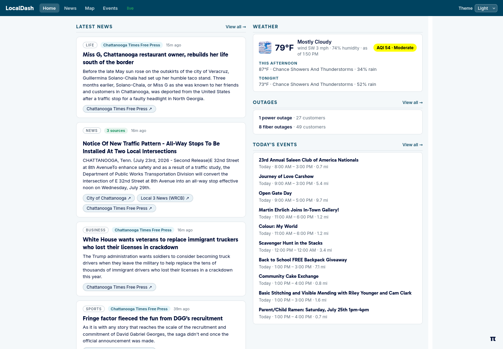

# LocalDash

A self-hosted dashboard for what's happening in your area right now — local news,
live 911 calls and power outages on a map, upcoming events, and the weather, all
on one page.

LocalDash currently ships sources for the **Chattanooga / Hamilton County, TN**
area. The app itself is not tied to one place — the site name, map center, and
tile layer are all configurable — and support for other cities is planned.



## Features

| Feature | Route | What it does |
| --- | --- | --- |
| **Home** | `/` | At-a-glance digest — latest news, weather, current outages, today's events |
| **News** | `/news` | Local headlines from eight outlets, clustered so one story shows once with a link per outlet |
| **Map** | `/map` | Live and historical map of 911 calls, road incidents, outages, and water advisories |
| **Events** | `/events` | Area events from several calendars, de-duplicated, tagged, and sorted by distance |

**Weather** is the fifth feature and has no page of its own: current conditions,
today's forecast, and air quality appear in the strip on the home page, proxied
from the National Weather Service and AirNow.

Every page updates live over a single WebSocket, and there's a light/dark theme
switcher in the header.

## How it works

Most of the upstream feeds only publish a **snapshot** of what's active right
now — the 911 feed tells you which calls are open, not which calls happened
yesterday. LocalDash polls each source on a schedule, tracks every incident by a
stable id, and records a new observation whenever its status or position changes.
That's what turns a live-only feed into history you can scrub back through on the
map.

News, Events, and Weather are separate pipelines and don't work this way — they
aggregate and de-duplicate records rather than tracking things over time.

### Built-in map sources

| Source | What |
| --- | --- |
| [Hamilton County TN 911](docs/hc911-api.md) | Active 911 incidents |
| [TDOT SmartWay](docs/tdot-smartway-api.md) | Roadway incidents, construction, and special events across TN |
| [EPB Outages](docs/epb-outage-api.md) | Chattanooga electric and fiber outages |
| [TN American Water](docs/tnaw-advisory-api.md) | Water advisory affected-area polygons across TN |

Each links to a reverse-engineered reference for the upstream API. The map's
**Source** selector switches between them.

## Quick start

You need [Docker](https://docs.docker.com/get-docker/) and nothing else. This
brings up the database and the app together; the app waits for the database, runs
its migrations, then starts serving and polling.

```bash
docker compose up --build
```

Then open <http://localhost:8000>.

> If you hit `permission denied … /var/run/docker.sock`, add yourself to the
> `docker` group once: `sudo usermod -aG docker $USER`, then start a new shell (or
> run `newgrp docker`) and try again.

## Configuration

LocalDash runs on sensible defaults with no configuration at all. To change
anything, copy the example file and edit it:

```bash
cp .env.example .env
```

`.env.example` covers the settings you're most likely to want; `app/config.py`
is the full list. The ones most worth knowing:

- **`SITE_NAME`** — the name shown in the header.
- **`CENTER_LAT` / `CENTER_LON`** — the map center, and the origin that event
  distances are measured from.
- **`TILE_URL` / `TILE_ATTRIBUTION`** — the map tile layer.
- **Per-source toggles and poll intervals** — for example `HC911_ENABLED` and
  `HC911_POLL_INTERVAL`. Please don't poll a source faster than it actually
  updates; the defaults are chosen to be a good neighbor, and LocalDash
  identifies itself with a descriptive `USER_AGENT`.
- **`RETENTION_DAYS`** — how long to keep observation history. The default keeps
  everything forever.

Once the app is running, the full API is documented and browsable at
<http://localhost:8000/docs>.

## Expose it publicly (optional)

The `cloudflared` compose service publishes the app over HTTPS without opening
any inbound ports — it dials **out** to Cloudflare, so it works behind NAT and
needs no port forwarding or static IP.

One-time setup:

1. Add a domain to Cloudflare (free plan is fine).
2. In the **Zero Trust** dashboard under **Networks → Tunnels**, create a tunnel.
   Under **Public Hostname**, route your hostname to `http://app:8000`.
3. Copy the tunnel's connector token into `.env` as `CLOUDFLARE_TUNNEL_TOKEN`.

```bash
docker compose --profile tunnel up -d --build
```

Only the app is exposed; Postgres stays private to the compose network.

> **LocalDash has no authentication.** Anyone with the URL can read the dashboard
> and the API. If that matters, put Cloudflare Access (free) in front of it.

## Contributing

Setup, tests, and linting are in [CONTRIBUTING.md](CONTRIBUTING.md).
Architecture, conventions, and the git workflow are in [AGENTS.md](AGENTS.md).

## License

LocalDash is licensed under the **GNU Affero General Public License v3.0 or
later** (AGPL-3.0-or-later). See [LICENSE](LICENSE) for the full text.

Because this is an AGPL-licensed network application, if you run a modified
version of LocalDash and let users interact with it over a network, you must also
offer those users the corresponding source code of your modified version.
